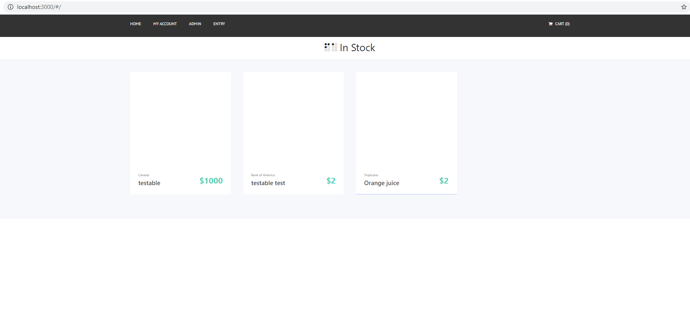
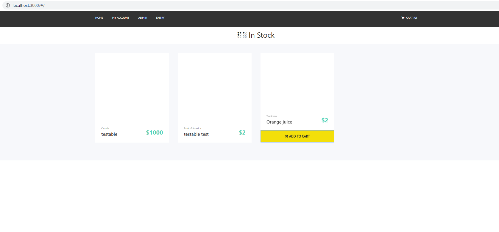
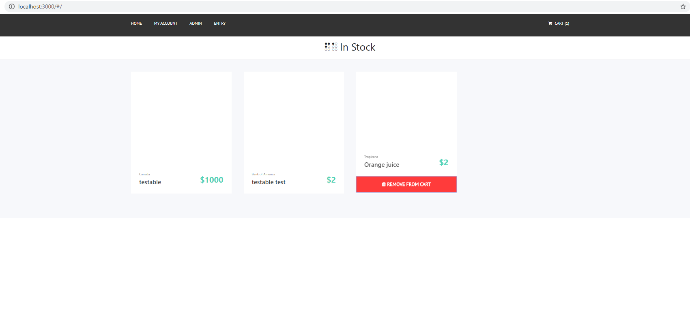
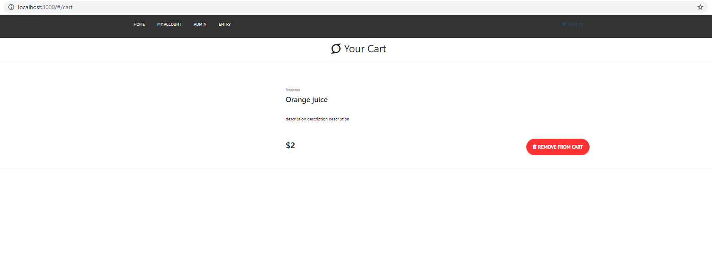
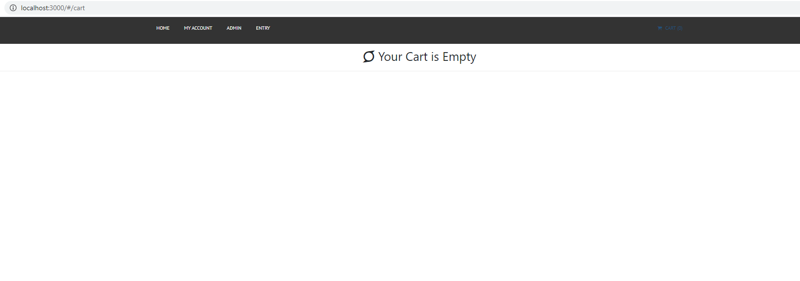
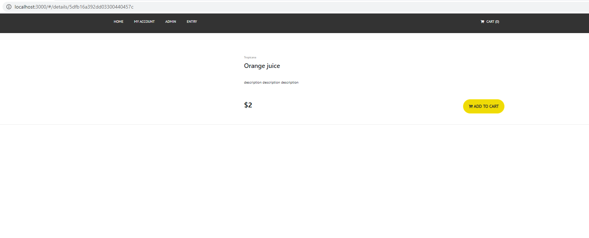
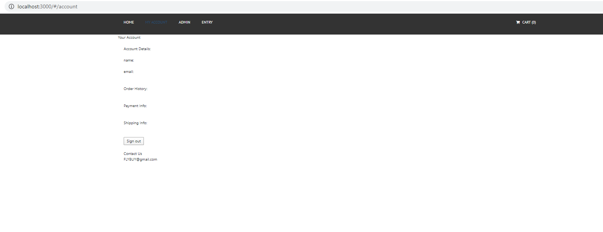
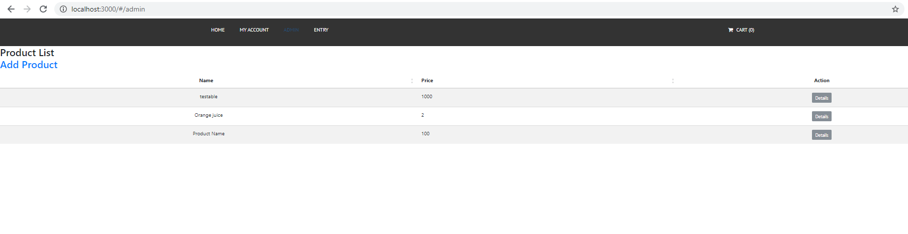
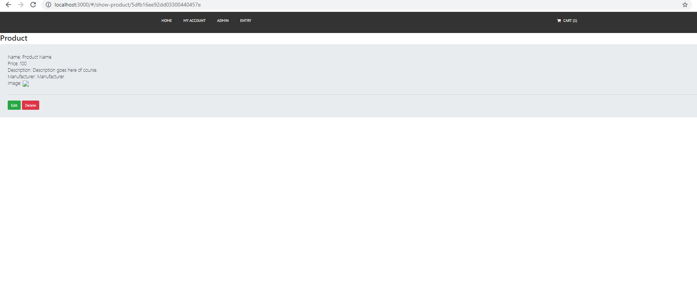
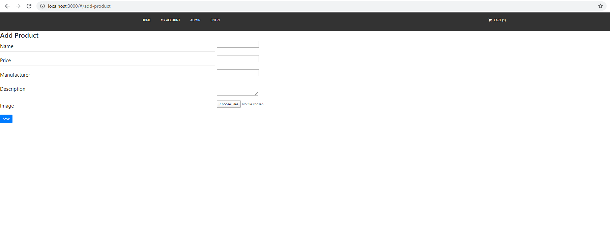

# ASP.NET Core Crypto-Currency Exchange Simulator Web Application

## Basic Application Features

 * This application is designed to allow users to sign up and create an account/log in to an existing account.

 * Once an account has been created, users can buy/sell crypto-currencies based on real-time prices with the virtual balance they have been alotted on sign up.

 * There is no real money exhanging hands in this application. This is just a simulation of buying/selling crypto currency to get people exposed to the crypto market for free.

 * The user's balance and total value of assets is displayed on the user's account page.

 * The hangfire framework server runs in the background and requests the data on cryptocurrencies every 15 minutes. This would be updated up to the minute if there was not a limit on the amount of API calls that you can make to the Alpha Vantage API to get crypto-currency data for free. I wanted to keep development cost of this application absolutely free.
 
 * You can visit this application at http://107.178.212.130:31077


```markdown
Home Page:
```



```markdown
Home Page (Adding to Cart):
```



```markdown
Home Page (Removing From Cart):
```



```markdown
Cart Page:
```


```markdown
Empty Cart:
```


```markdown
Product Details Page:
```



```markdown
Account Page:
```



```markdown
Admin Page:
```



```markdown
Show Product:
```


```markdown
Edit Product:
```


```markdown
Add Product:
```



## Background

Immediately after completing my MEAN stack E-Commerce project, I debated between iterating on development features to really polish off the newly finished application, or creating another web application that used the ASP.NET Core framework.
After all, I had already spent a good deal of time learning the framework already. And I thought it would be more advantageous to have a fully completed, from scratch ASP.NET Core appliaction deployed on web because it would increase the range of my skillset. 
I also really wanted to prove to myself that I could do it, and do it quickly. Thus, I began brainstorming ideas for an appliaction that I would find just as useful and intriguing as the E-Commerce project that I had just completed. I knew that if I could come with such an idea, the project would be a success. 


Something that I had always wanted access to growing up was some sort of stock trading simulator. I didn't want to spend any actual money, but I wanted to learn what it was like to trade stocks. So, I knew that this was the correct idea for a project. I had a personal interest and drive for the concept of the application. I began looking for an API that I could access to retrieve financial stock data in real time, and stumbled upon the AlphaVatnage API which gave access to stock data and crypto-currency data. Once I saw this, I was intruiged and changed the direction of the project to be directly focused on crypto-currency data.


### Main topics of Development and Deployment 
#### (See bottom of readme for a detailed write-up)

 * API Call structure & limit
 * Switching to layered architecture
 * Switching to ASP.NET Core
 * Hangfire Background Service
 * Deployment with Docker, Kubernetes, and Google Cloud


## Lessons Learned / Skills & Knowledge Gained


From this project I learned that I should spend more time researching technologies if I want development and deployment to be as efficient as possible, but in this case, all of the learning that came with my mistakes was very valuable.

I gained tons of high-level conceptual experience and practical implementation experience with Docker, Kubernetes, and Google Cloud Platform.

Migration from ASP.NET to ASP.NET Core.

Structuring an application for modularity and extensibility.


## What Went Wrong

Investigating the technologies I'm using a little bit more beforehand caused me to delay for timeline for the project. I was hoping to complete it within a week, but it took me about 2 weeks.

I need to implement testing procedurals other than manual functional testing. It's hard to resist using the debugger to resolve bugs.


## What Went Right

 * I used the lessons that I learned from my previous project
 * I am very happy with what I have learned about the technologies used for the project.
 * I am very happy with what I learned about my work process and how I can improve it in the future.
 * I am very happy with getting to use and refine my problem-solving skills.
 * I used Agile software Development iterative development
 * Completion of the project for the resume.
 * Had fun pursuing something that interested me.


## Future Plans
 * I would like to secure the application with https along with other security features to be determined.
 * Email Verification
 * Better Styling
 * Search bar to search for and view the portfolios of users on the application
 * Sitewide leaderboard to display the top earners on the application on the home page
 * Shows your account's earning rank compared to all the other users on the application
 * More currencies. I would like to someday have to top 50 currencies on the application
 * Can click on a coin to see its price history and yearly, monthly, daily price charts


## Detailed Write-up of Development and Deployment

### Development
I actually began development using the older ASP.NET framework as opposed to the newer ASP.NET Core framework. I chose this framework because I had seen many job postings with ASP.NET in the reuirements list instaead of ASP.NET Core. I also had no expereince with the ASP.NET framework, so I wanted to see where the two frameworks differed. 

For this project I followed an iterative development process. I implemented base functionalities and iterated and added one feature at a time from a list of features. So, once I began working on the application, I was foolish and failed to follow the layered architecture concept that I had recently learned. In doing this, my code became very hard to follow and had high levels of coupling and low levels of modularlity. This bothered me, and I refactored the code into the 4 standard layers described in layered architecture. This primarily consisted of me abstracting the data persistence layer away from the controller logic. When I was doing this, I wanted to my implementation of this new layer to focus on increasing the modularity, extensibility, and readability of the application code. I created helper methods in a class the persistence layer with as few interdependencies between methods as possible. In the future I plan on abstracting related into separate classes once the size of the class gets too large. I also wanted very descriptive method names for the helper methods so that, paired along with the comments in the controller layer, it will be very easy for othersa nad myself in the future to read and understand the code. 


I ran into one issue while working with the ASP.NET framework that led to a large change. Initially I started with only working with one cryptocurrency that was available to view, buy, sell in real time. However I was calling the API on each one of tese actions. The AlphaVantage API limits their free users to 5 API Calls a minute or 500 API calls a day. 
So, I realized my current process for calling the API was unfeasible and inefficient anyway. I decided that it made more sense to use a background service to Call the API and update the database and then use the freshly updated database data for viewing, buying, and selling. This approach would be much more scalable with a large userbase. And it was a necessity for me given that I was only allowed a set amount of API Calls.


To implement this background service I found out that I could use a standard background service. But, I noticed that there was a framework called hangfire available for ASP.NET Core. I was intruiged by Hangfire because of it's simple and lightweight implementation. I saw this as ideal because I only needed to perform one simple task. But, to use Hangfire I had to switch to the newer ASP.NET Core framework. I decided to make this move and it gave me experience migrating from framework to framework (this highlighted the differences between the two even more to me, so I saw this as a win-win. I gained experience with ASP.NET but I also got to use the newer and more recommended Core framework. Once migration was complete, implementing Hangfire was very simple and went quickly.


### Deployment 
Deployment for this project was quite the learning experience. I had only had one previous experience deploying an application to the internet. This was when I was deploying my MEAN stack E-Commerce application. Beforehand, I knew that I wouldn't be able to use mLab for my database service. And as I did more research, I found that if I wanted to deploy with Heroku again, I would have to create a Docker Image, but I still didn't find any options for a cloud SQL database. So I began looking for options and I decided to deploy with the Google Cloud Platform. I was attracted to GCP because of the number of services they offer and the 300 dollar credit you receive with a new account. 


So I started studying Docker and Kubernetes. And then referred to the GCP tutorial for a basic outline on how to upload a Docker image to the Google Cloud Registry and then deploy to a Kubernetes cluster with GCP's Kubernetes Engine.
