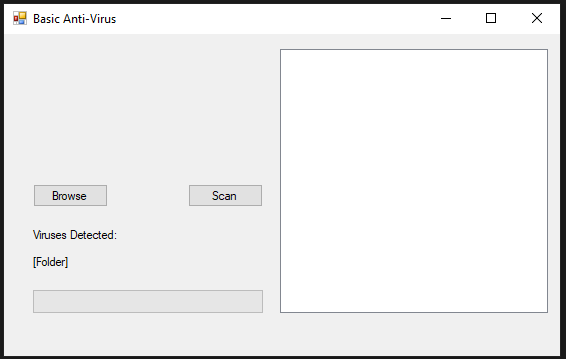

This is a simple static anti-virus that performs more as a static virus detector. This project was created in Visual Studio with Windows Forms and C#.

The Form offers two buttons, one button labeled "Browse" opens up a folder browser dialog where the user can choose a file/folder to scan for malware/viruses.

Once the user has a folder selected, the scan button will work properly. The user clicks the scan button and on doing so, the program will compare the md5 hashes of the file(s) specified during the browse operation, to the md5 hashes within the text file that contains the md5 hashes of many known viruses.

If a file comes up as a match to one of the hashes within the virus list, the Absolute filepath and filename of the file will be displayed in a list box on the right side of the form.

Immediate Future Plans: In the future I plan on upgrading from md5 hashing to one of the Secure Hashing Algorithms (SHA). I also plan on adding some type of logo or graphic in the empty space on the form. Finding a database of SHA hashes of known viruses. I would also like to expand the size of my virus database to as comprehensive as possible.


```markdown
The Application Interface:
```



## What Went Right

I really enjoyed this project becasue I have always had an interest in security related concepts. I gained experience with Hashing files and also with Windows forms. It was refreshing to try something that wasn't one of the usual web development related projects that I am usually doing

This project is a great starting point to iterate on. Development on this project went very smoothly and quickly.

## What Went Wrong

I haven't actually downloaded any of the virus files that exist within my database to do a controlled test. I have scanned a a few big folders on my computer and found nothing so far. I want to test this project on a vm and on my parents ancient pc. Maybe it will have a positive effect there and find a virus. 
