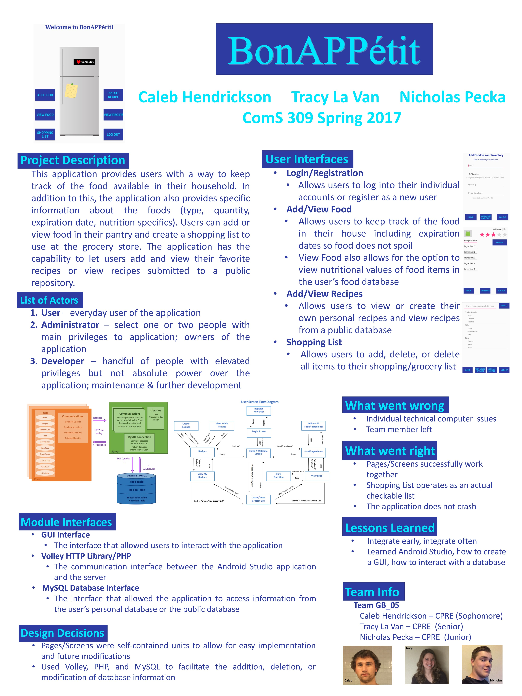

## Bon Appetit Android Application

[Back Home](README.md)


### Description

This application provides users with a wat to keep track of the food available in their household. In addition to this, the application provides specific information about the foods (type, quantity, expiration date, nutrition specifics). Users can add or view food in their pantry and create a shopping list to use at the grocery store. The application has the capability to let users add and view their favorite recipes or view recipes submitted to a public repository. 

We began with an idea which we extended to screen sketches to show a general idea of what we wanted our application to look like. From there we mapped out how we wanted the various screens to interact with each other and finally, we created a block diagram to understand what it would take for our application to communicate with a database. We split up the various screens in our application to tackle the project before the final deadline. To be successful, we had to learn how to use several new tools including Android Studio, volley, PHP, and MySQL. To learn these new tools and debug error messages, we used various sources such as our course’s teaching assistant, StackOverflow, and w3schools.org.

```markdown
The Home Screen of the Application:
```


```markdown
The Final Poster for our Project:
```



### Lessons Learned / Skills & Knowledge Gained

In terms of technologies learned, we learned how to tie Android Studio, PHP, volley, or MySQL together to make an application from scratch. We were able to get the project working on an android phone.

This was my first time working on a project of this magnitude as we were creating a full-scale android application. I learned the importance of and how to create a software architecture and how to create a block diagram before writing any code. These tools were tremendous help in mentally modeling the structure of our project during development. I enjoyed the problem solving throughout the course that came from learning how to integrate components together to form the final product.

The other big takeaway from this project was, when using version control software, all group members need to integrate early and integrate often to avoid major merge issues.

Despite not being able to complete all of the functionalities of our project, this taught us a few things about time management and creating a minimum viable product. As well as prioritizing what functionalities were more urgent and important to implement. 
This class also gave me experience with working with team members of widely varying skill level. I will admit I felt overwhelmed at the start of this class, I had never worked on a project of such a magnitude or with a team of this size. In my previous coding classes I had only been allowed to work in teams of two. But jumping into this class early in my college career taught me a lot about the group dynamic.

Because of this class, I gained my first experience in the dynamics of working on a team to develop a product. There were several challenges that come with working in a team that I did not realize. Chiefly among those were scheduling, allocating resources, and picking technologies based on the skillsets that we had to work with.

Scheduling was much tougher than I expected. Trying to coordinate 4 members with nearly completely different schedules to meet was not easy as one member was working part time and another member lived 35 minutes away from the university. This left most of the in-person meeting up to myself and one other member of the team who lived nearby. Thankfully I was able to make these meetings because there was a lot of progress made debugging the interface between my computer and android studio, the IDE for the application. This was great experience for me because I was not even aware of the possible headaches that can come with debugging interfaces. Eventually we came to realize that my computer had an incompatibility with android studio and that I would have to rent a computer from the university. Unfortunately, this caused quite a delay for me towards getting into development and contributing to the codebase of the project. This leads me to another area that I gained my first experience in, choosing technologies to work with. Luckily, our group had a strong idea for an app to develop, but we had limited experience in our IDE. I would say that the IDE was probably the best tool for the work that we wanted to accomplish, but we were lacking the skillsets initially and this led to a learning curve that ate up a lot of development time at the start of the project. Because of these factors, I would consider this class a great learning experience for me.

### What Went Wrong

We lost a group member partway through the semester because he dropped the course; however, we were not aware for quite some time due to being unable to get in touch with him. 

I had never worked with android studio or even Git before this course. There was also one other member of our 3-member team that had not worked with Git before either, so there were a couple code pushing errors during the course of our project. This along with the initial learning curve of learning the technology ate up a lot of time and hindered our progress.

A big issue was a lack of commitment shown by group members and lack of ‘pushing’ code until the week before the demo (Not well experienced with git and how to properly use it).

Allocating the resources to complete our project was tough, when the project began, none of the team members had any experience with Android Studio, PHP, volley, or MySQL.

We were unable to complete full functionality because we did not populate our database with recipes scraped from google. This would have been a whole other project on its own and we did not have nearly enough time to include this feature with only 3 developers and one semester working with new technologies.

### What Went Right

This was a seminal experience for me and group software development. I gained loads of experience with critical technologies such as Git. As well as gaining important experience working in a group and what working in that group environment entails.

I learned about how the back-and-forth interactions between team members can influence the direction of the entire project. Especially when it comes down to deciding on what technologies to choose or how to implement a technology.

We completed the core functionality of our project and were able to release a working product by the deadline.

Although we were unable to implement our original idea, we were able to take what functionalities we had and demonstrate their was value and utility in what we had completed.


