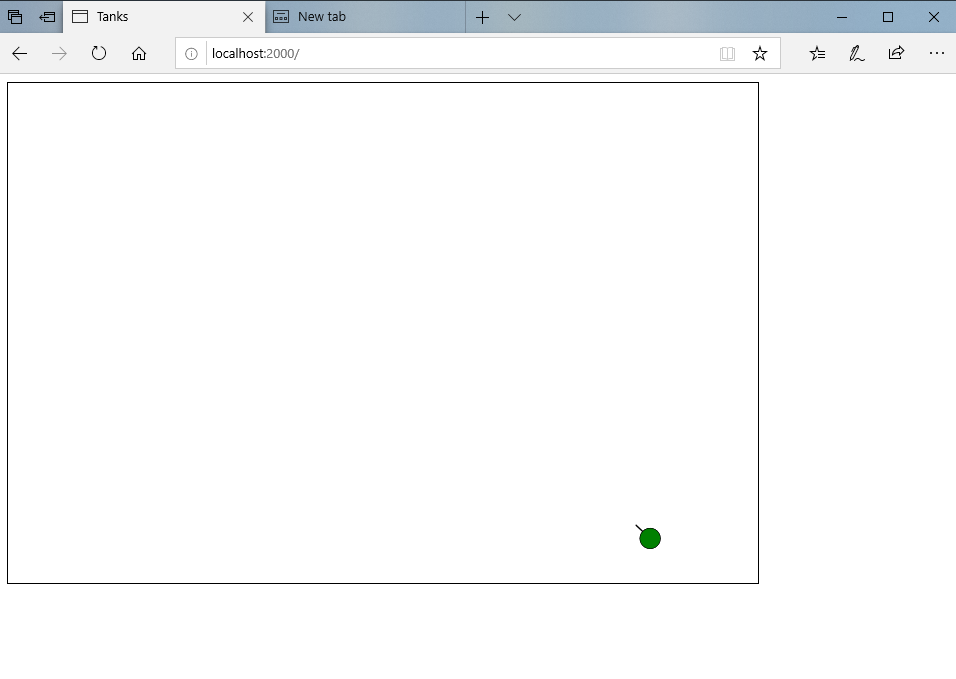
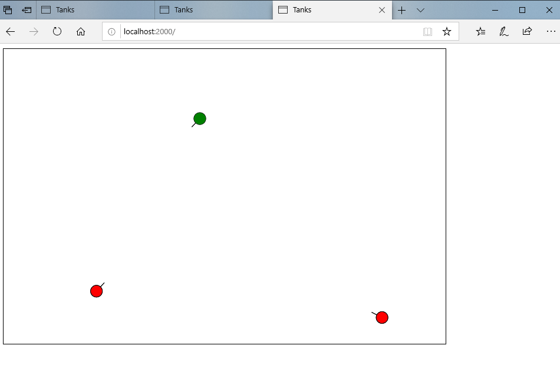
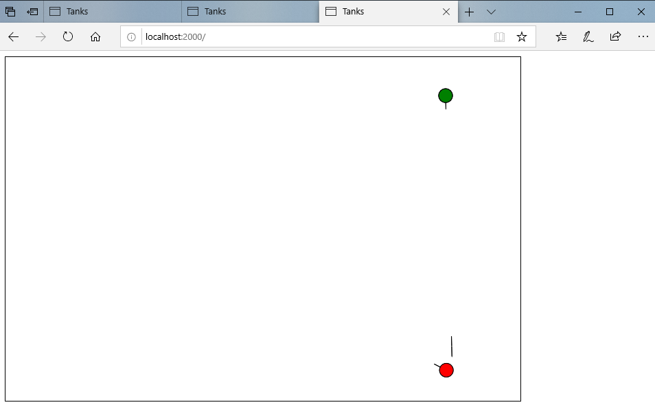
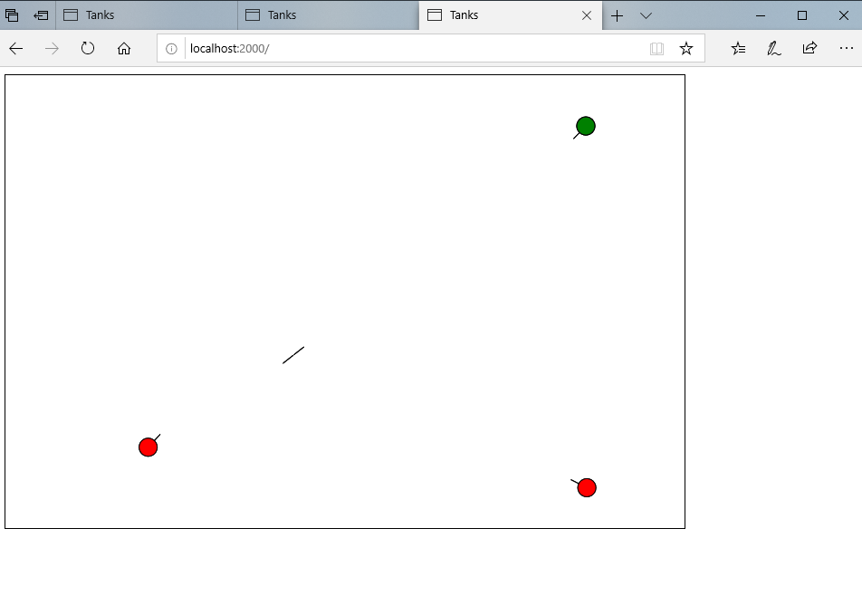

## In-browser Tanks Game

[Back Home](README.md)


### Description
This project is an in-browser multiplayer Tanks game. When a user connects to the localhost, they will spawn in the canvas with one life and a health total. Of course, the other living users connected to localhost will be visible to the new user and the new user will be visible to the other players. Enemy players will appear as red to each user. Players can move around the screen using the w, a, s, d keys. Their tank’s turret follows the players mouse, allowing them to aim at the enemy tanks. Lastly, players can fire shots by clicking their mouse.

In our project, we used sockets to send necessary information, such as a player position, hp, and other player attributes. This was a similar idea to using sockets in Java, however, node.js made things a lot simpler with the socket.emit() and socket.on() functions. Having these functions made the code much shorter and cleaner. We had not previously worked with node.js, so we had to teach ourselves through tutorials point. This was how we figured out the socket.emit() and socket.on() functions.  Another new aspect for us was using eventListeners, which are in the index.html script. We used the keydown listener to set variables w,a,s,d to true, depending on the key value that was pressed. Keyup did the opposite, setting w,a,s,d to false depending on the key value that was released. The click listener is used to tell when the user fires. All of these listeners use functions that we added socket emitters to, which send the data to the server so the server can decide, for example if the tank can fire, or if it is still reloading, and then create a projectile and at it to the list of projectiles.


```markdown
Screenshots of the finished project:
```










### Lessons Learned / Skills & Knowledge Gained
Before this project, I had never used Node.js, and had very limited experience with HTML.

Because this project was very open-ended, a lot of creativity and thought went into this project. The first thing my partner and I could agree on became our starting point. This starting point was the idea that we wanted to create a multi-player game. After some deliberation, we decided on making a tanks game.

After landing on this idea, we went to the drawing boards. One of the things that I really enjoyed during this project was the creativity involved. I loved having creative freedom. We had the choice to take the project in whatever direction we wanted as long as it was web development related. Also, we had the freedom to choose what features we wanted to implement as well as how we wanted to implement them. This freedom was refreshing and gave me a fondness for my first experiences with web development.  

In order to be able to implement the project incrementally, we began developing the project as a single player game, with only one tank with the ability to move and shoot. This turned out to be the bulk of the project. We further broke the project down into smaller tasks.

Here's a list of the tasks:

	- We wanted to make the barrel swivel by following the location of the mouse
	- We had to decide what we wanted the tanks to look like
	- We needed to determine how we would accomplish the multiplayer aspect of the 	project
	- We need to learn how to use sockets and node.js.
	- We needed to be conscious of what the user needed to know from the server versus what the server needed to know.
	- The development and handling of projectiles and their collisions.
	- We needed to figure out a way to get rid of a projectile anytime it went out of bounds or collided with a player
  
### What Went Wrong

When we were decided to use straight lines for projectiles instead of circles for projectiles, we had to spend a considerable amount of time reimplementing our collision system. This was because the collision system that we had already implemented did not operate well with the new straight-line projectiles. We could have planned better for this at the beginning of the project. We did not create any type of plan for our development process, we just went where the next issue took us. 

We had no experience with and were not taught sockets and node.js in class, the downside of this was that there was a learning curve to learning these technologies that took up a lot of development time in the beginning stages of the project. But in the end, this was a positive because it was actually a very rewarding experience to learn these technologies on our own.

### What Went Well

We used a lot of creativity and thought to implement the barrel rendering algorithm.

The decision to go with vector math for our barrel rendering algorithm as opposed to taking a trig heavy route proved to much more efficient to implement into our project. It was much cleaner and probably easier to implement. We did not have to deal with using lots of tangents, arctangents, and other trigonometric functions.

We learned how to document our progress and describe in detail what we did to complete the project as well as how each piece of our code contributes to the overall game.

We learned how to take on challenges and make adjustments when necessary, as was done with the projectile shape.

We learned how to make design decisions such as deciding between two different algorithms (Vector math and Trig math).

We learned how to code efficiently, as was done when we made sure to keep our client-side code minimized.

