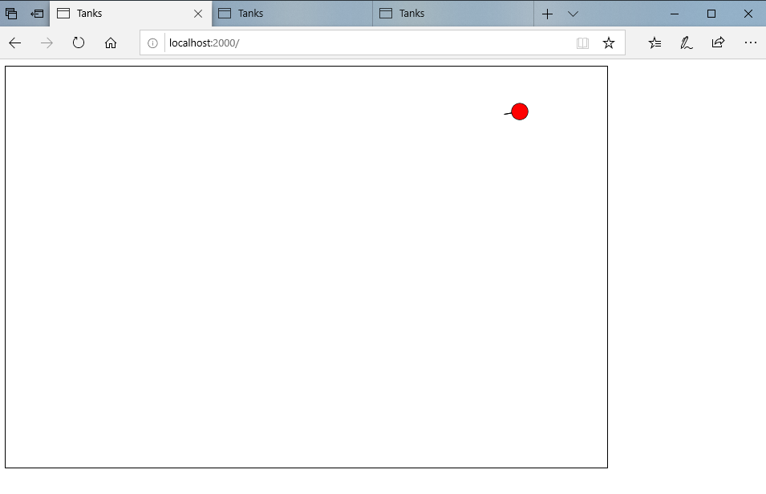

## In-browser Tanks Game

[Back Home](README.md)


### Description
This project is an in-browser multiplayer Tanks game. When a user connects to the localhost, they will spawn in the canvas with one life and a health total. Of course, the other living users connected to localhost will be visible to the new user and the new user will be visible to the other players. Enemy players will appear as red to each user. Players can move around the screen using the w, a, s, d keys. Their tank’s turret follows the players mouse, allowing them to aim at the enemy tanks. Lastly, players can fire shots by clicking their mouse.

In our project, we used sockets to send necessary information, such as a player position, hp, and other player attributes. This was a similar idea to using sockets in Java, however, node.js made things a lot simpler with the socket.emit() and socket.on() functions. Having these functions made the code much shorter and cleaner. We had not previously worked with node.js, so we had to teach ourselves through tutorials point. This was how we figured out the socket.emit() and socket.on() functions.  Another new aspect for us was using eventListeners, which are in the index.html script. We used the keydown listener to set variables w,a,s,d to true, depending on the key value that was pressed. Keyup did the opposite, setting w,a,s,d to false depending on the key value that was released. The click listener is used to tell when the user fires. All of these listeners use functions that we added socket emitters to, which send the data to the server so the server can decide, for example if the tank can fire, or if it is still reloading, and then create a projectile and at it to the list of projectiles.


```markdown
Screenshots of the finished project:
```





### Lessons Learned / Skills & Knowledge Gained
Before this project, I had never used Node.js, and had very limited experience with HTML.

Because this project was very open-ended, a lot of creativity and thought went into this project. The first thing my partner and I could agree on became our starting point. This starting point was the idea that we wanted to create a multi-player game. After some deliberation, we decided on making a tanks game.

After landing on this idea, we went to the drawing boards. One of the things that I really enjoyed during this project was the creativity involved. I loved having creative freedom. We had the choice to take the project in whatever direction we wanted as long as it was web development related. Also, we had the freedom to choose what features we wanted to implement as well as how we wanted to implement them. This freedom was refreshing and gave me a fondness for my first experiences with web development.  

In order to be able to implement the project incrementally, we began developing the project as a single player game, with only one tank with the ability to move and shoot. This turned out to be the bulk of the project. We further broke the project down into smaller tasks.

Here's a list of the tasks:

	- We wanted to make the barrel swivel by following the location of the mouse
	- We had to decide what we wanted the tanks to look like
	- We needed to determine how we would accomplish the multiplayer aspect of the 	project
	- We need to learn how to use sockets and node.js.
	- We needed to be conscious of what the user needed to know from the server versus what the server needed to know.
	- The development and handling of projectiles and their collisions.
	- We needed to figure out a way to get rid of a projectile anytime it went out of bounds or collided with a player
  
Below I go into more depth on the process behind completing each task:

---The first complex part came when we had to make the barrel swivel with the mouse. 
The first complex part came when we had to make the barrel swivel with the mouse. This took a bit of thought as well as creativity. We started out by using an angle from the center of the tank to the mouse, but then realized how sloppy that would be with having to use a lot of tangents, arctangents, and other trigonometric functions. Personally, after evaluating this part, I thought the trig route would also be much more difficult in comparison to other ways of carrying out the barrel swivel. Soon after, we thought of using vector math to accomplish this. I figured that if we could draw a line from the center of the tank to the mouse, we could calculate a shorter version of it, that would start at the center of the tank. This is the method we stuck with and the method that is described in the complex section (page 4). I believe that this step involved a large amount of creativity to carry out, I feel like most people would have used the trigonometric version, it being the first to come to mind when thinking of angles between objects. I believe our method is much cleaner and possibly shorter than the other. To find the right barrel length to use, we simply used trial and error, we rendered multiple tanks with different barrel lengths until we found a look that was aesthetically pleasing to us, causing us to evaluate many different forms.

---And after that would come deciding what we wanted the tanks to look like(barrel length, tank body shape, etc.)
To find the right barrel length to use, we simply used trial and error, we rendered multiple tanks with different barrel lengths until we found a look that was aesthetically pleasing to us, causing us to evaluate many different forms.

---How we would accomplish the multiplayer aspect of the project
Deciding what the tanks would look like and also how we would accomplish the multiplayer half of the game. Rather than struggle with both at the same time, we immediately began developing the game in a single player fashion, just make one tank that has the ability to move and shoot.

---A big thing that we learned during this project was how to use sockets and node.js.
A big thing that we learned during this project was how to use sockets and node.js. This was fairly complex and a bit hard to grasp at first and even seemed overwhelming. Once you get the hang of sockets, they become a very powerful tool that add a lot to the program. The two main things we used from sockets were the emitters and the on() functions. These together make the backbone of our code.

---It took a bit of thought on our behalf on what the user needed to know from the server versus what the server needed to know. (Understanding the client-server architecture) 
It took a bit of thought on our behalf on what the user needed to know from the server versus what the server needed to know. It was obvious from the start that the server would know much more than the user, but how much more was the question. We started by having the only thing that the user knew was the x and y of both of the tanks, the user did not even 
know which tank was theirs unless they moved it or checked to see if the barrel was following their mouse. At this time, the server had an id for each socket and acted on each depending on the information received through the individual sockets, and then sent the two tanks back through to the clients. Eventually, we decided we could add more to this by sending the client its socket id upon connection. The reason for this is so that the client knows which tank belongs to it, allowing the client to color its own tank green, and all enemy tanks red
the user did not even know which tank theirs was unless they moved it or checked to see if the barrel was following their mouse. We were able to color the tanks by sending the client its socket id upon connection.

---More creativity came in the development and handling of projectiles and their collisions.
More creativity came in the development and handling of projectiles and their collisions. For projectiles, we teetered between the idea of using circles as the bullet, or straight lines parallel to the direction in which they were travelling. The fall back to using lines was the collision system we initially implemented did not work very well. However, we thought lines looked better than black circles so we stuck with lines. To create this lines, we used a construction similar to that of the barrel, however the lines also contain a rise and run variable. These variables decide how much the bullet moves in the x and y direction at every frame change, rise being y and run being x. These are calculated by subtracting the x and y values of the end points from each other.

---I had to figure out a way to get rid of a projectile anytime it went out of bounds or collided with a player
The test collision function is also vector based. We find the x and y distance from the center of a tank to a projectile, then calculated the length of the vector formed by this x and y. The length is then compared to the radius of a circle, if it is less than or equal to the radius, that means that the projectile is intersecting the circle and therefore a collision has occurred.
Another new aspect came into play here, I was used to using Java ArrayLists so I had to figure out a way to get rid of a projectile anytime it went out of bounds or collided with a player. To do this, we use the delete array[index] syntax to remove the desire projectile, therefore stopping it from being rendered and tracked by the client and server.


### What Went Wrong

When we were decided to use straight lines for projectiles instead of circles for projectiles, we had to spend a considerable amount of time reimplementing our collision system. This was because the collision system that we had already implemented did not operate well with the new straight-line projectiles. We could have planned better for this at the beginning of the project. We did not create any type of plan for our development process, we just went where the next issue took us. 

We had no experience with and were not taught sockets and node.js in class, the downside of this was that there was a learning curve to learning these technologies that took up a lot of development time in the beginning stages of the project. But in the end, this was a positive because it was actually a very rewarding experience to learn these technologies on our own.

### What Went Wrong

We used a lot of creativity and thought to implement the barrel rendering algorithm.

The decision to go with vector math for our barrel rendering algorithm as opposed to taking a trig heavy route proved to much more efficient to implement into our project. It was much cleaner and probably easier to implement. We did not have to deal with using lots of tangents, arctangents, and other trigonometric functions.

We learned how to document our progress and describe in detail what we did to complete the project as well as how each piece of our code contributes to the overall game.

We learned how to take on challenges and make adjustments when necessary, as was done with the projectile shape.

We learned how to make design decisions such as deciding between two different algorithms (Vector math and Trig math).

We learned how to code efficiently, as was done when we made sure to keep our client-side code minimized.

