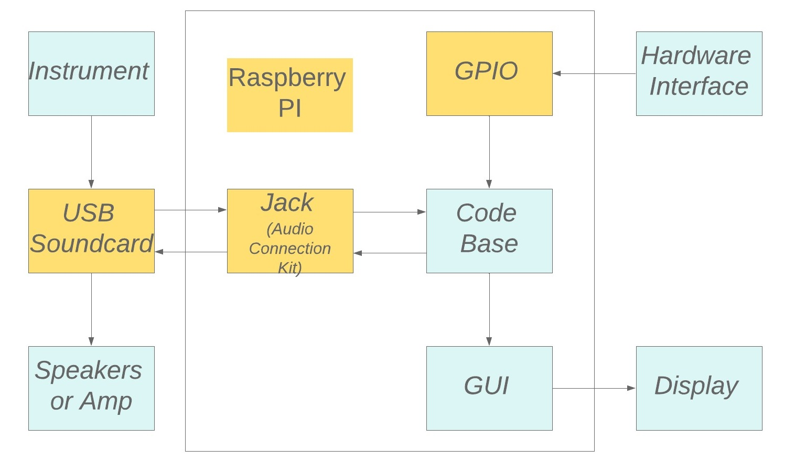
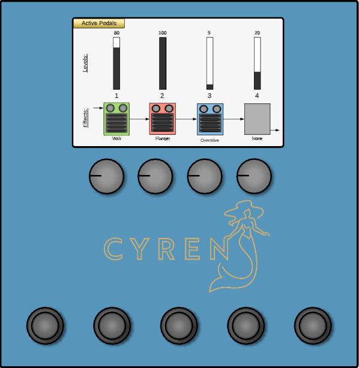
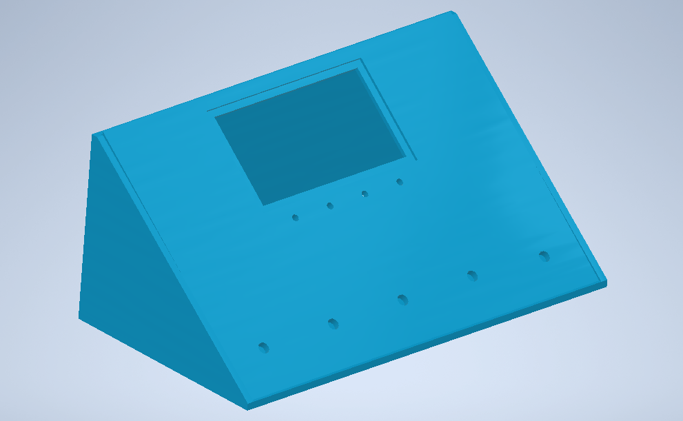
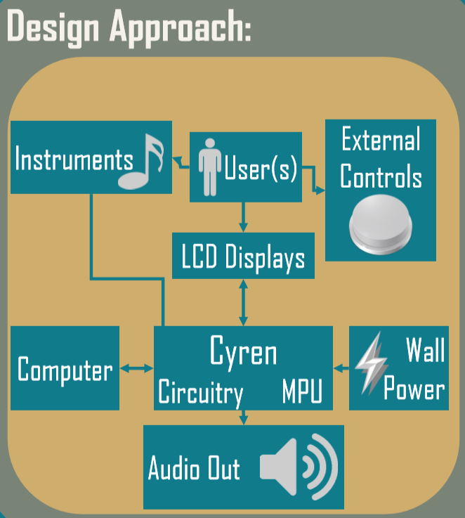
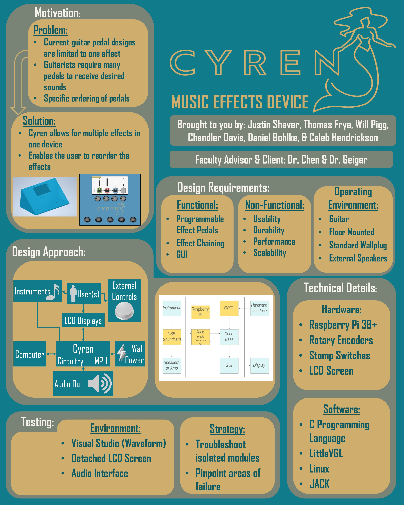

## Senior Design Project

[Back Home](README.md)


### Description

For my senior design project, my team had the task of developing a multi-effect guitar pedal box. We divided our six team members for this project into three teams. Two team members worked on the GUI component of the device, two members worked on the hardware components of the device, and myself and one other member were tasked with working on the codebase for the project. 

We divided work on the codebase into multiple categories. The digital effect functions, audio routing, and the communication with the GUI. I had full responsibility of the creation of all of the effect functions and a good portion of the audio routing. This entailed setting up an audio server with the correct settings, which was done using the Jack routing utility to establish capture ports on the USB interface where the guitar would be plugged in. These ports were routed to an input port on a Raspberry Pi via the Jack server where the Jack client could interact and manipulate the audio signal. The transformation of the audio signal was determined by the parameters received from the GUI interface. The code for the audio effects making the transformation to the signal were gathered from Audio Effects: Theory, Implementation, and Application by Andrew McPherson and Joshua Reiss and from Digital Audio Effects, & a document from the Stanford Center for Computer Research in Music and Acoustics. After this transformation was complete, the audio signal was copied to an output port where the Jack server could route the signal to the broadcast ports on the USB interface allowing  for the altered signal to be broadcasted via speakers.


```markdown
A Link to the Demo Video for the Project:
```
[Senior Design Project Demo](https://youtu.be/KdHss8cUgA8)

```markdown
The High Level Block Diagram for our Project:
```



```markdown
The GUI design for our Project:
```



```markdown
The Enclosure design for our Project:
```



```markdown
The Design Approach for our Project:
```


```markdown
The Poster for our final Presentation of the Project:
```



### Lessons Learned / Skills & Knowledge Gained

I learned many digital signal processing concepts:

  - Audio Signal Sampling
  - Fourier Transforms
  - The Frequency Spectrum
  - Convolution
  - Difference Equations
  - Bandwidth/Transition Band
  - Audio Routing

These concepts are generally considered to be electrical engineering concepts which, before this project, I had absolutely no experience in. Nonetheless, I am proud of myself for being able to succeed in taking on the challenge and self-teach along the way.

However, I probably gained more experience working in a team. There was also a lot of non-technical knowledge gained during the course of this project. Key areas would be leadership, communication, dealing with design changes, research, testing, and accontability. Examples lessons learned about good practice in these arreas would include:  

  -Prompt and clear communication(makes everyone's lives easier)

  -Thorough research makes development and implementation easier, it mitigates the 	likeliness of design changes

  -Accountablity to deadlines is critical because once you fall behind, you open the 	door to falling more behind and a non-       finished product.

  -Leading the team forward when no one else is encouraging the team to work on 	their respective tasks.


### What Went Wrong

When testing the software effects, I should have tried to make the testing environment for the software effects as similar to our production environment as possible. The main issue being that I was testing with discrete time audio samples. Whereas on the actual device we were working with non-discrete time samples. The algorithms I had used for some of the effect functions were designed for audio signals with finite impulse response which worked for the type of data I was receiving in the test environment. But in production, the impulse response of the data was infinite(being continuous). This rendered several of the effects useless, there was not much time left in the semester, so I had to quickly come up with two simple and easily implementable algorithms that would work with a continuous audio signal and our data. 

Unfortunately, scheduling meetings for the team was very difficult. During the weekdays, only 3 of our teammates lived in Ames (The home of Iowa State University), and on the weekends only 2 of our teammates were present in Ames. The rest of our team is scattered elsewhere across Iowa. So needless to say, meeting in person every week was not practical. This also made simple hardware handoffs very difficult.

Unfortunately, scheduling meetings for the team was very difficult due to all of our team members busy schedules. There wasn’t a single time slot in the entire week where everyone in our team could meet and participate in the meeting. This is something that we should have taken more seriously and tried to combat more accurately to stay organized and keep the project moving forward. We should have moved to some type of a multi-meeting schedule, perhaps 3 meetings a week where a portion of the group that could make that meeting time would attend/voice call/video conference. This would make sure that everyone in the group had attended at least one meeting that week and that everyone was on the same page with the status of the project’s development and would keep development moving steadily.

If more research had been done towards implementation of the project,  we would have had fewer issues during development. Mainly, that being the choice of our microcontroller, the RockPro. We probably should have looked into the amount of documentation and how easy it would be to interact with the RockPro’s onboard sound card. If we had done more research on this device, we would not have had to switch microcontrollers and design late in the development life cycle like we did. We also could have done a lot more research in the theory side of audio signal processing and implementation as a group and that would have made the project progress much more efficiently. For example, understanding things like sample rate, bit depth, and fourier transformation, etc. early in the projectwould have made the development of the project flow much more smoothly. We also could have put more time into the research of our choice of GUI library because that was another aspect of the project's deisgn that was changed late in the project's life cycle.

Because everyone in our group was very comfortable with each other, we failed to hold each other accountable to adhering to project timeline deadlines and to gaining progress on the project in a timely manner as individuals. This was a very tricky problem to navigate.


### What Went Right

Thankfully , despite all of the setbacks we encountered during the development of the project, we were able to complete the project on time, minus a couple features we had orignallly planned to include. I learned a lot about audio signal processing. And primarily, I am happy to have gained loads of experience of working in a group dynamic. I feel that I more clearly understand the qualities of communication, leadership, and accountability that are required to keep development of a project running smoothly.

I also gained experience working on a team within the group where the task of the team was to specialize in completetion of  a specfic component in the project, with other components that were considerably different from a technical viewpoint. 
