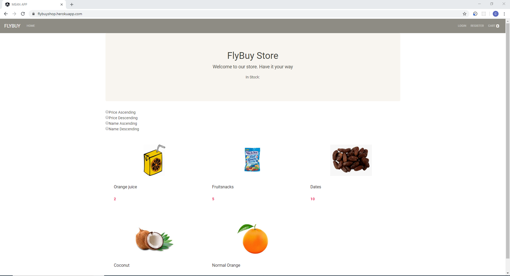
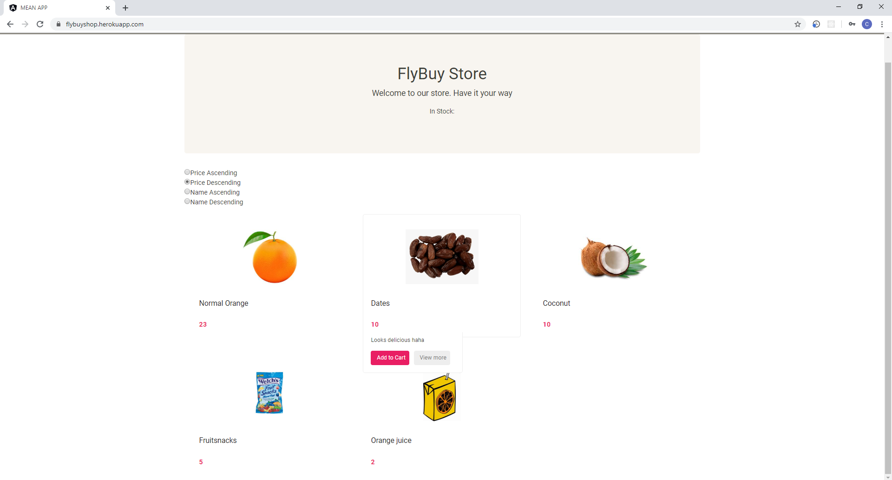
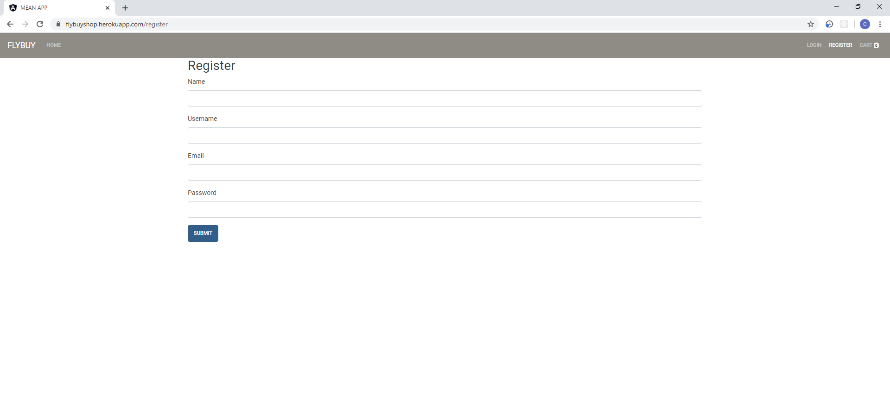
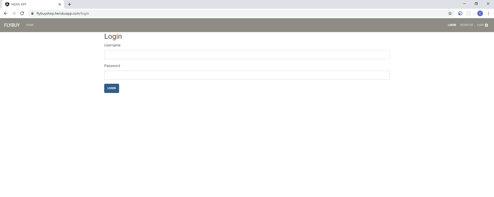
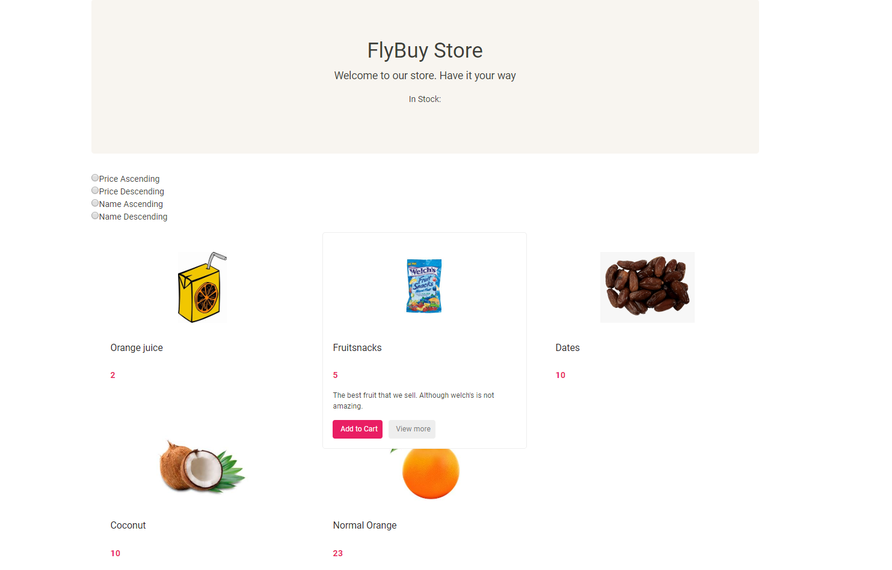
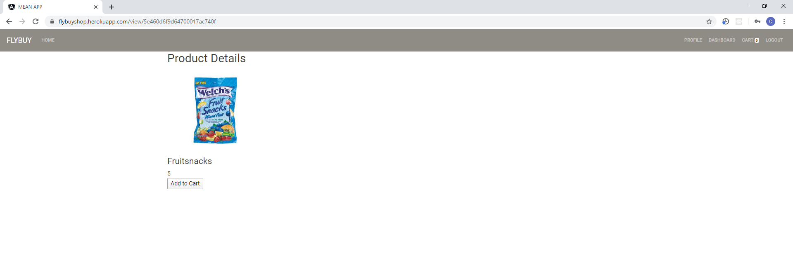
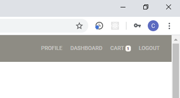
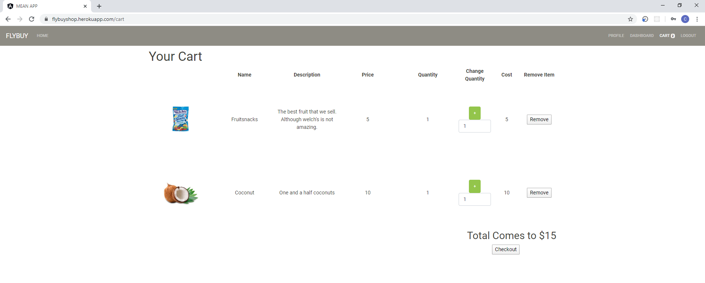
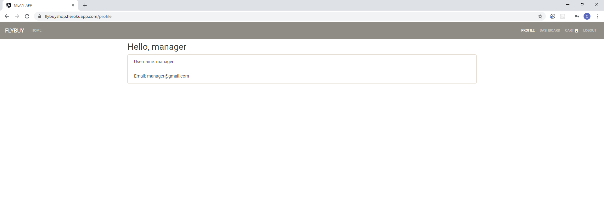
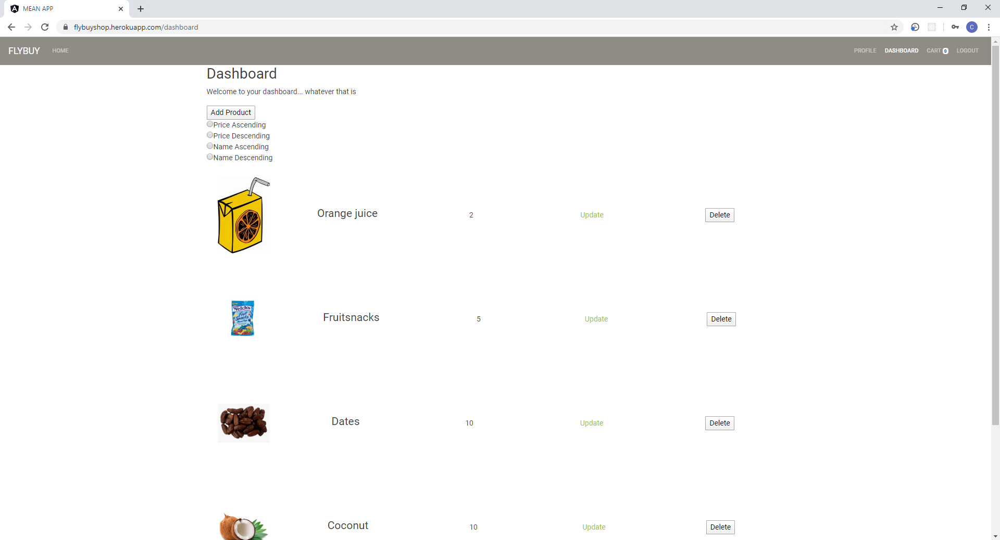

## MEAN Stack E-Commerce Project

[Back Home](README.md)

### Non-Technical Description
I created an e-commerce web application where non-admin users can browse a list of products, view their details, and add the products to their shopping cart. Admin users can upload, edit, and delete the products displayed on the website from an exclusive admin dashboard. Visitors have the option to create an account but it is not required. This was a feature I felt strongly about. I wanted to make site access convenient for the ordinary user.

# Deployment
This application was deployed using Heroku's cloud web hosting, mLab's cloud database service, and AWS S3 bucket cloud file storage for image file storage

# Features of the Application:

  Navbar
  
 * Contains links to the different pages within the application 
  
 * Navbar links differ depending on if the user is an administrator or not an administrator of if the user is logged in or not
    
 * The adminstrator account functionality is a superset of user account functionality
    
 * Contains a counter next to the cart link to let users know how many items are in their cart instantly
    
  User Functionality:
  
    Pages/UI Routes
    
      Home
      
        * Product list
        
        * Each product card shows the product image, price, name
        
        * Each card also contains an Add/Remove from cart button
        
        * Each card also contains a view more button to view more product details
        
      Registration
      
        * Registration form
        
      Login
      
        * Login form
        
      Profile
      
        * Displays account information such as name, username, and email
        
      Product Details
      
        * Displays product image, name, description, and price
        
        * Add/Remove from cart button
        
      Cart
      
        * Allows users to view all of the items that they have slected for their cart
        
        * Allows users to increase/decrease the quantity of the items in their cart
        
        * Remove product button to remove that item from the cart completely
        
        
  
  Administrator/Manager Additional Functionalities:
  
      Dashboard
      
        * Hub for navigating to editing, creating, and deleting products
        
        * Contains an add product button and an edit product button to route the user to the appropriate form
        
        * Can delete products and their data from the database with the click of the remove product button
        
      Add Product
      
        * Add product form
        
      Edit Product
      
        * Edit product form
        

```markdown
Home Page:
```



```markdown
Home Page (Sorted by Price Descending):
```


```markdown
Registration Page:
```


```markdown
Login Page:
```


```markdown
Product Mouse Over:
```


```markdown
Product Details Page:
```


```markdown
Cart Counter:
```


```markdown
Cart Page:
```


```markdown
Account Page:
```



```markdown
Admin Dashboard:
```


```markdown
Edit Product:
```


```markdown
Add Product:
```


### Lessons Learned / Skills & Knowledge Gained 

The completion of this project was a long time coming. I first had the idea for this project in the Summer of 2018. At the time, I had decided that I wanted to work with the MEVN JavaScript stack. This choice was fairly arbitrary, I had only selected it because I found a tutorial that I thought would be helpful. In the end, I did not end up using this tutorial but I liked the design of the appliaction within the tutorial and I wanted to keep the design with some changes. I gained experience with JavaScript, Node, MongoDB, and Vue through my initial efforts on the application that summer. However, I did not come close to finishing the application. If I had consistently kept at it, I would have been able to finish the application in the following months during my free time from school. However, I am not sure that I had a strong enough grasp on the high level concepts of web application design and architecture, so I don't know for sure how long it would have taken me only working on it sparingly. 

Round two of work on this application began again in the summer of 2019. I continued with the MEVN stack and restarted from scratch on the codebase. I progressed further than I had the previous summer, but I was not able to put my full focus on the project this go around because I was preoccupied with a summer course and the start of development for my senior design project. i put my senior design project at a higher priority because I did not want to let my team down and I believe that required coursework should come first. I continued work on the project through the fall of 2019, but I was never happy with the amount of time I spent on the project. However, I don't believe that this was the reason why I had not successfully completed the project.

Fast forwarding to my December 2019 graduation, (approximately a whole 18 months after starting the project) I began applying for jobs but I didn't have any strong personal projects to put on my portfolio. And this project had been on my mind. A personality trait that is ingrained in me (that I can't stop myself from doing it unless I really try), is that the longer, and with the greater intensity I work on a problem, the desire to complete the task increases. In this scenario, I had just managed to let other things take my attention away from the project. I would also say that I never truly put intensity into the completion of the project.

As I was searching through web development jobs, I found that there were not very many jobs hiring for the JavaScript stack, and there were very many hiring for Java EE and ASP.NET frameworks. Upon discovering this, I felt really foolish for realizing this so late. I didn't have any practice with either framework. So I decided that I really wanted to dive in gain experience with one of the two and implment the E-Commerce project that I had failed to complete for the last year and a half to accomplish two things at once. I decided to go with the Microsoft stack for two reasons. I had seen from several sources online that it might be a little bit easier to go with ASP.NET first. Also, I didn't know much of anything about C#, and I really prefer to have some type of understanding of many things rather than a specialized understanding of a few things. I had already used Java quite heavily at Iowa State so I was familiar with it. It wasn't until I started studying C# that I realized how similar the two languages are. Before studying C# I didn't even know that it was an object oriented language.

So I started diving into the ASP.NET developer course on LinkedIn learning. This course covered a lot of ground and helped my get my footing. The RESTful API sub-course was 4 hours and was the turning point in my understanding of the high level concepts associated with web development such as architectures, and how data flows through the back-end of an application. This was something that I was very lacking previously and was holding me back in my attempts to develop my project in the past. ASP.NET conventions use a very structured aproach towards development and this was critical building my understanding of how to develop a web application. I never used these concepts in my development with the JavaScript stack and I was inept because of it.

Now that I realized this I was excited to try out this new concept. I had new sense of confidence that I could use these concepts and succeed with the JavaScript stack that I had originally started with and I would be able to finsih the website within a week. But I decided to make one change. I was content with using Vue for my front-end when I first chose my tech stack because in 2018 there were many articles saying that Vue could become just as relevant if not more relevant than Angular or React. But, I could see that that prediction did not come to fruition. So again, to try to gain another more marketable skill, I chose angular for my front-end framework. I had officially deided to move to the MEAN stack. And development went very well this time around. I had finally gained all of th skills that I needed to develop efficiently. I started from scratch with MEAN stack and finished the project in about a week (There are still many advanced functionalities that I want to implement on this application in the future, I will cover these tasks in detail later).

The big things I learned from this experience:

Don't try to implement a state of the art module on the first go around. Develop your base level functionality and develop ITERATIVELY. This way you can understand exactly where you went wrong. Since you are trying to implement multiple aspects of a functionality at once. I had problems with this previously becasue I was lazy and I thought I could cheat the system and bust out the best practice way of building a feature on the first try without much previous experience with that specific feature. BUILD on you knowledge. Break a daunting task down into many smaller more attainable tasks and complete those tasks one by one. And if you do so, you will reach your goal.

You must understand things from a high level before digging around in the mud and implementing lower level functionalities. You need to understand where a module fits in the grand scheme of your application. This allows you to think for yourself. This is critical for building your MENTAL MODEL. Something I have found is absolutely critical. A mental model is basically your mental visualization of a concept. We think in ideas. If you cant zoom out, you cant understand a modules practical use. And if you cant understand that, you will truly be lost. Convert your task into something that can conceptualize. Start simple and iterate on that basic idea. I like to think of it like a tree. Our base level understanding is like the tree trunk, and then we can get more and more specific on the increasingly technical aspects needed to understand the topic. Each of these abstractions adds a branch to the tree. The first few branches are fewer and larger. and then increasingly many in number and much smaller and precise. Basically this is the concpet of abstraction. Taking a topic and determining it's characteristics in such a way that takes advantage of the way that humans understand things. Similar to the way the world wide web works. You read an articale and you find many subtopics for that topic that are needed to be understood to properly understand that topic. You click the hyperlink and read that article, and you find more articles, etc. Tim Berners-Lee built the web in this way because it takes advantage of the natural way that humans think.


### What Went Wrong

I need to start incorporating stronger testing practices within my development processes. For testing along the way, I used a manual functional testing approach throughout this project.


### What Went Right

I used an agile development appraochapproach with myself and it was benficial

I learned a lot about learning and what my personal pitfalls are when it comes to learning

1. Don't be lazy/"in a hurry"

2. Observant/open your eyes/be ready to learn

3. humility/be ready to learn/realiz you aren't that good and you can always and must improve if you don't want to be left behind  and stay on the same level forever


I am satisfied with my stack, framework, and library choices for this project and I am very happy with what I have learned about these tools and the outcome of this project.

I am very happy with what I learned about my work process and how I can improve it and myself in the future.

I am very happy with the refinement my problem-solving skills and the knowledge and understanding that I gained on this project.

The deelopment, deloyment, and maintenance of the application is 100% free.

Had fun pursuing a project that I see value in and interests me.


