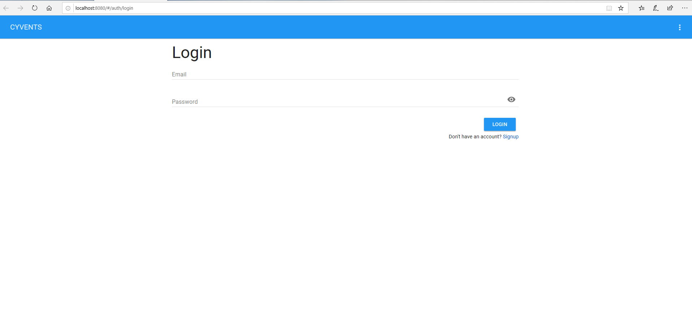
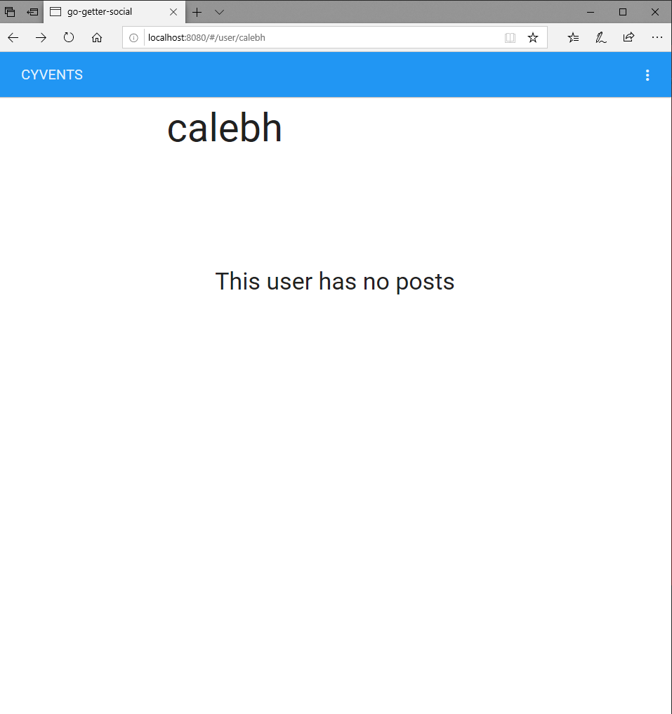

## Social Media Event Web Application


[Back Home](README.md)


### Description

This project is a social media event app developed for SE 329 Project Management class at Iowa State University. The goal is for this app to function as an event focused social media site with user authentication and posting. The posts will allow users to create "events" that will be in the near future (i.e. tonight). The users friends will be able to RSVP for an event up to a given participation limit set by the creator, at which point the event will be removed from non-participating users' feeds.


```markdown
Login Page:
```



```markdown
Home Page:
```


```markdown
Create Event:
```


```markdown
Viewing New Event on the Public Events Page:
```


```markdown
Account Page:
```


```markdown
Account Setting Page:
```


### Lessons Learned / Skills & Knowledge Gained

This was my first time working with a third-party API. We worked with the google maps API to implement the location feature in our application.

This was also my first time working with a database service like firebase. In my previous web development projects I worked with an in-memory data store. Working with firebase was a good experience for me because I was exposed to a new way of looking at database implementation. I enjoyed working with firebase because of its simplicity and free usage.

Despite not being able to complete all of the functionalities of our project, this taught us a few things about time management and creating a minimum viable product. We also learned lessons in prioritizing what functionalities were more urgent and important to implement. 

This class gave me my first experience with the software development process that is promoted and used in industry. I learned of the iterative nature of the agile development process and how to adhere to it during the life cycle of a project from concept to release.

### What Went Wrong

 * Before this project, I had no experience with express or firebase, so I did not have any technical experience to contribute on the server-side and backend of the application.

 * One of our team members was not familiar with any of the technologies being used within the project.

 * Managing the contributions of group members was tough, some members flew through their tasks, and others struggled. But in the interest of completion of the project and not equality of the division of work, members were encouraged to take up new tasks from our Trello board as soon as they had completed their current tasks. This was what was best for the project, but created some tension between group members.

 * We never had enough time to implement the add friends feature of our project by the time of the final deadline.

### What Went Right

 * Entering this project, I had experience in node.js. I also had experience with React.js but I had not worked with Vue.js at this point. Luckily, the transition from React to Vue was not that time intensive. 

 * Our team’s use of Git & Trello helped development to progress smoothly. Trello kept our project very organized and what was next to be completed very clear. Git helped tremendously in organization, allocation of tasks, and documentation of our project.

